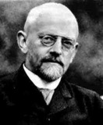
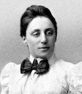

# Ich besuchte David Hilbert

## Autor: [Teiji Takagi](https://www.aozora.gr.jp/cards/001398/files/50908_41912.html), Publikation: November 1932

Ich besuchte David Hilbert in Göttingen am 8 Oktober 1932.

Am Abend um 7:15 Uhr oder früher, wanderte ich hin und her,
durch den Weg vor dem 29sten Haus an der Wilhelm-Weber-Straße.
Da sah ich manche Sterne, die man kürzlich selten sehen kann.
Der herbstliche Wind war so kalt. Es entsprach meiner Stimmung,
dass einige gefallene Blätter von einer Linde verstreut waren.

Dann hatte ich ein Rendezvous mit einem Fräulein.
Das Fräulein war Professorin Emmy Noether.
Sie hatte mir freundlicherweise versprochen,
dass wir zusammen Professor Hilbert besuchen würden.
Sie sagte, wenn ich ihn für mich besuchte, 
würde ich um stockendes Gespräch verlegen sein.

Das Haus des Professors ist 29st an der Wilhelm-Weber-Straße.
Es ist schon lange her, dass ich sein Haus erstmals besuchte.
Damals am Haus war ein allgemeines Pförtchen, und ein kleiner Vorgarten mit Pflanzen.
Aber die Pflanzen wurden ein Wäldchen in dreißig Jahren.
Wegen der Dunkelheit, konnte ich nicht erkennen,
ob es Pflaumen oder Birnen im Wäldchen gab.
Jedenfalls die Saison war gerade richtig für Obst.
Ich dachte mir, dass er und seine Frau sicher die Obst auf ihrem Tisch häuften.
Der Flur war auch dunkel. Da kam eine Haushälterin heraus, um anzumelden.
Aber Professorin N, die das Haus gut kannte, verlieߥ die Haushälterin,
und leitete mich schnell ins Gästezimmer, ohne uns angemeldet zu haben.
Vielleicht hatte sie schon telefonisch angemeldet.
Professor H kam bald heraus, und sagte: "Ich weiߥ euer Versprechen.
Herzlich willkommen." Dieses Jahr ist Professor H genau siebzig Jahre alt.
Er sah gesund aus, und zeigte ein Lächeln auf dem knabenhaften Gesicht wie früher.
Mehrere Jahre vorher, bekam er eine Krankheit, die schwer zu heilen war.
Ich hörte, die Krankheit heiße so und so auf Latein, das ich vergaß.
Seine Leber soll nicht richtig funktioniert haben.
Einmal hatte er die Hoffnung der Heilung fast aufgegeben.
Dann gerade in Amerika wurde eine neue Arznei entdeckt.
Die Arznei soll sein Leben eben noch gerettet haben.
Aber es war unsicher, ob die bloße Arznei genug wirksam war.
Deshalb soll er ein Viertel roher Leberwurst täglich essen.
Er sagte, wenn er diese Kur aufhörte, würde sein Leben jede Woche schwinden,
wegen der unheilbaren Krankheit.
Die Kur wirkte gut, und er bekam die Lebenskraft wieder.
Damit konnte er dieses Jahr zum Kongress in Zürich ausgehen.

Vorletztes Jahr nahm Professor H seinen Abschied von der Universität Göttingen.
Danach soll er jede Woche einmal eine Vorlesung in der Uni noch frei halten.
Vielleicht liest er über die Grundlagen der Mathematik vor.
"In diesem Wintersemester wollte ich alles tun, was ich noch nicht erledigt habe.
Aber wider Erwarten sind Assistenzprofessoren kritisch gegen meine Studien.
Ich kann doch nichts anders tun als langsam zu studieren, ohne mich zu treiben.
Formalismus ist sehr wichtig für Mathematik.
Das muss jeder von uns bejahen.
Aber manchmal kann man mit dem Formalismus nicht alles erledigen.
Da gibt es viele Probleme..." murmelte der alte Professor,
als ob er mit sich selbst spräche.
Dabei konnte ich nicht umhin, heimliche Tränen zu weinen.

Einige Jahre vorher, schrieb ich eine populäre Erklärung über die Grundlagen der Mathematik.
Darin ist ein Satz des folgenden Inhalts:
"Professor H will jeden Kuckuck rufen lassen, um seine lebenslange Erinnerung zu machen."
Damit drückte ich freilich aus, wie eifrig er die Grundlagen der Mathematik lösen will.
Aber die Allegorie vom Kuckuck war unzutreffend.
Es war zu befürchten, dass der Satz einen höhnischen Eindruck auf die Leser machte.
Deshalb wollte ich woanders die folgende Bedeutung beschreiben:
"Die Grundlagen der Mathematik mögen vollendet werden.
Oder sie mögen unvollendet werden.
Immerhin wünsche ich nur, dass Professor H seine letzten Jahre in Behagen verbringt."
Jetzt ist es mir eingefallen, dass ich das zu beschreiben vergaß.
Trotz des Kampfs mit der unheilbaren Krankheit,
und trotz mancher krittelei von jüngeren Assistenzprofessoren,
muss er das Gesetz der ausgeschlossenen Mitte beweisen. Warum?
Es kommt ihm gar nicht in Frage, den Rest des Lebens zu genießen.
Es scheint als ob er in Höllenqualen lebte, oder?
Furchtbar ist der Wissensdrang, der auch unheilbar ist.

Dann schaute ich auf Professorin N. Offenbar sah sie auch verlegen aus.
Vermutlich hörte sie ihn fast jeden Tag murmeln.
Es war ganz natürlich, dass sie anderes Gefühl als ich hatte,
denn ich traf ihn nach zehn Jahren.

Professor H lenkte oft das Gespräch in verschiedene Richtungen.
Er redete sogar über soziale Fragen.
Er sagte, es gebe allzu viele Menschen, die Erde sei zu eng,
aber der Fortschritt der Wissenschaft würde die Schwierigkeiten irgendwie überwinden,
und so weiter. Wenn ich mich nicht täusche, sagte er auch:
"Ach was, Russki können nichts tun."

Allmählich wurde das Gespräch transzendental.
"Ich glaube fest an unendlichen Fortschritt der Menschheit.
Die fünf tausend Jahre lange Geschichte der Menschheit ist überhaupt Null im Vergleich zur Unendlichkeit der Zeit.
Inzwischen sind wir jedoch bisher weit fortgeschritten.
Außerdem erklärt die Naturwissenschaft,
dass  wir uns in Milliarden Jahren von Schäumen zur heutigen Menschheit entwickelt haben.
Sowohl Milliarde wie Billion sollen wenig sein.
Hiernach werden wir in ewigen Zeiten unendlich fortschreiten..."

Als ein Steinblock seit Milliarde Jahren erschien,
winkte Professorin N mir mit den Augen.
Während des ewigen Fortschrittes standen wir auf.
"Wir sind unwillkürlich lange geblieben, denn wir haben deiner interessanten Rede zugehört.
Du magst doch wohl schon müde sein. Herzlichen Dank. Angenehme Ruhe."

Nachher am Abend hörte ich Herrn C sagen,
die Rede der Milliarde Jahre sei bekannt heutzutage in der Uni.
Darin soll man oft sagen: "Du hast ebenfalls die Milliarde gehört."
Ich hörte, Professor H lese neulich gern *Die Weltgeschichte* von H. G. Wells (ein bekanntes Buch,
neulich übersetzt ins Deutsche).

Professor H mag das Buch von Wells lesen,
oder mag er über den Fortschritt der Menschheit in Milliarde Jahren nachdenken,
als er eine Pause nach seinem mathematischen Studium macht.
Das ist mir gut, wenn er Pausen macht. Dann macht es nichts,
dass die Jüngeren sich mit dem Gerücht von der Milliarde unterhalten.
Zunächst ist das gut und glücklich.

Hier und da hörte ich Anekdoten über Professor H:

An einem Abend lud Professor H Gäste zum Haus ein.
Als die Ankunftszeit der Gäste nahte, sah seine Frau Käthe zufällig seine Kleidung.
Sie sagte: "O, David, du musst deine Krawatte schnell wechseln, schnell,"
und lieߥ ihn zum ersten Stock hinaufgehen.
Inzwischen alle Gäste sammelten sich im Haus.
Aber Professor H kam nicht herunter, obwohl die Gäste auf ihn lange warteten.
Als sie die Haushälterin ihn holen ließ, schlief er im Bett ruhig ein...
(Herr A nennt diesen Fall die Analytische Fortsetzung von der Lösung der Krawatte.)

---

Bei seiner Vorlesung an einem Montag, soll ein Student gemerkt haben,
dass Professor H ein Loch in seiner Hose hatte.
Noch am Dienstag sah die Studenten das Loch.
Sie beobachteten keine Veränderung des Lochs am Mittwoch, Donnerstag, und Freitag.
Daher wurde das Loch in der Hose des Professors bekannt in der Uni.
Dann berieten sich die Studenten. Sie beschlossen, ihm das Loch zu berichten,
ohne Kanten zu machen.
An einem Tag der nächsten Woche, spazierte Professor H mit den Studenten nach der übung des Seminars.
Dabei stieߥ er sich zufällig an einem Rad eines Lastwagens.
Ein Student ergriff die Gelegenheit, und sagte:
"Vorsicht! Ei, Professors Hose ist verletzt worden."
Professor H sagte: "Was? Wo? Ah, dieses Loch soll ich seit dem letzten Semester haben."

---

Noch eine Anekdote. Dies ist kurz, aber typisch Professor H.
Eines Tages besuchte ein Gast ihn zu Hause.
Der Besuch soll irgendwie eckig gewesen sein.
Der Gast und der Herr setzten sich, und sprachen einige Minuten miteinander,
über gutes Befinden oder schlechtes Wetter. Dann stand Professer H plötzlich auf.
Er sah sich nach seiner Frau um, und sagte: "He, Käthe,
ich habe den Gast lange aufgehalten. Also wollen wir uns eine Muße geben..."

